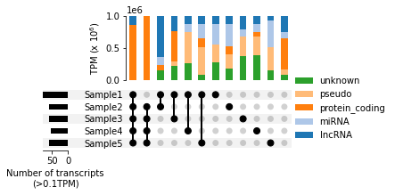

# viz
Reusable code snippets for (biological) data vizualization

## Overview
This repository contains Jupyter notebooks and datasets designed for visualizing biological data, particularly for gene expression analysis.

## Contents
- **Notebooks**:
    - `UpSet.ipynb` : A Jupyter notebook that generates UpSet plots to visualize intersections of gene expression data. The script restricts the displayed intersections to a user-defined relevant set and allows plotting proportions of reads (e.g., TPM) instead of gene counts. 
  
    - `GenomicFeatures.ipynb` : A Jupyter notebook to draw genomic features such as viral ORFs. 
  
    - `create_dummy_dataset.ipynb`: A Jupyter notebook to generate a synthetic dataset

- **Data**:
  - `data/dummy_gene_data.csv`: A synthetic dataset generated by `create_dummy_dataset.ipynb`. 

## Requirement
To run the notebooks, install the following Python packages:
- `pandas>=1.5.0`
- `numpy>=1.20.0`
- `upsetplot>=0.8.0`
- `matplotlib>=3.5.0`
- `jupyter`
